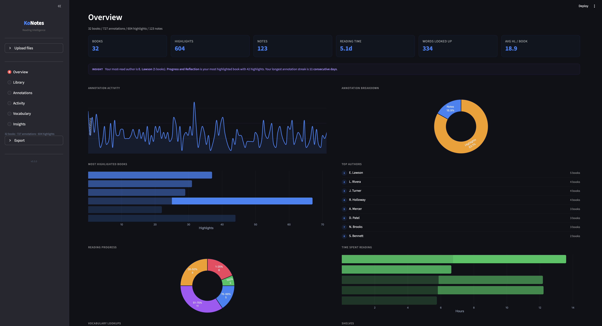
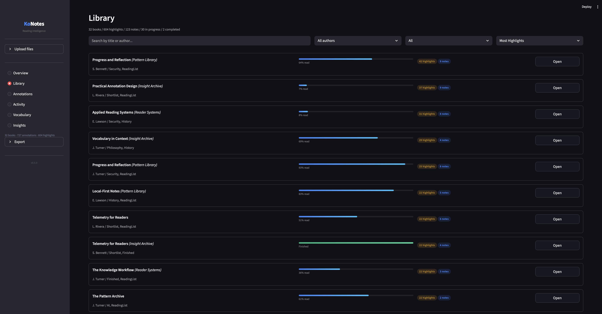
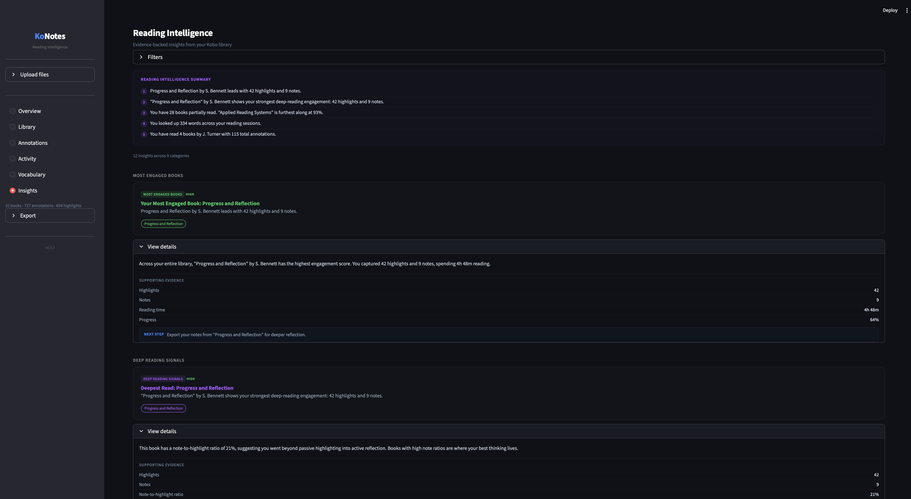
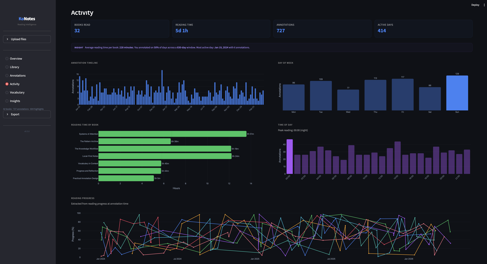
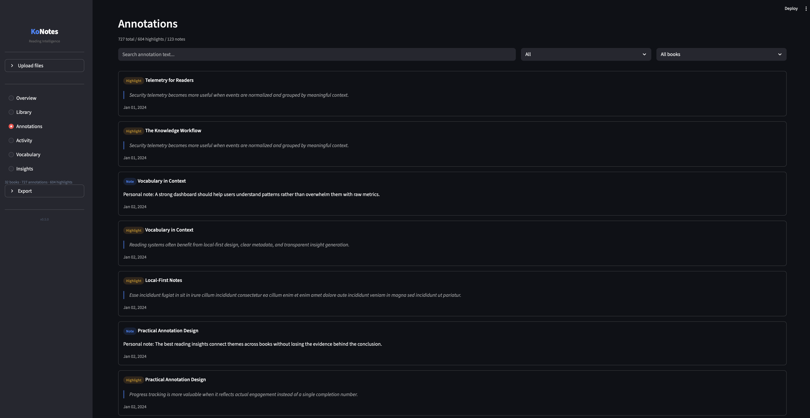
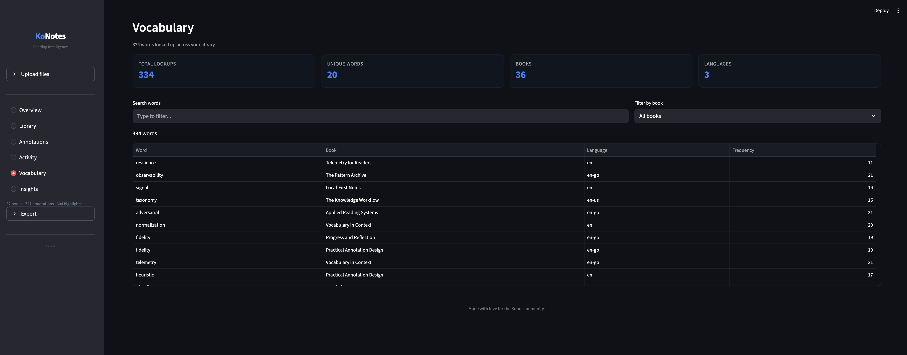

<div align="center">

<h1>KoNotes</h1>

<p>
Turn your Kobo highlights and reading data into structured, readable insight.
</p>

<br>

[](https://www.python.org/downloads/)
[](https://streamlit.io)
[](LICENSE)


[](https://konotes.streamlit.app)

<br>

[**Live Demo**](#live-demo) · [**Try It**](#try-it) · [**Features**](#features) · [**Example Insights**](#example-insights) · [**CLI**](#cli) · [**Web UI**](#web-ui) · [**Roadmap**](#roadmap)

<br><br>

> <em>No cloud required. No account. No tracking.<br><strong>Your reading data stays on your machine.</strong></em>

</div>

---

<br>

## The Problem

Kobo e-readers create rich annotation data -- highlights, notes, bookmarks, dictionary lookups, reading sessions -- but getting that data out and doing something useful with it is harder than it should be.

<table>
<tr>
<td width="50%">

**What Kobo gives you**
- An opaque SQLite database
- Messy, inconsistent HTML exports
- Plain-text dumps with unpredictable formatting
- Dictionary lookups and reading sessions buried in the database

</td>
<td width="50%">

**What KoNotes gives you**
- Clean, structured data from every format
- A local dashboard to browse, search, and filter
- AI-powered reading intelligence
- Export to Markdown, JSON, HTML, or plain text
- Full vocabulary and reading session history

</td>
</tr>
</table>

<br>

---

<br>

## What KoNotes Reveals

KoNotes isn't just a parser -- it turns raw reading data into personal intelligence about how you read.

- **Reading patterns** -- when you read, how long your sessions last, and how your pace changes over time
- **Highlight behavior** -- which books made you stop and mark something, and what themes keep resurfacing
- **Vocabulary growth** -- every word you looked up, how often, and in which books
- **Cross-book connections** -- ideas that echo across different authors, surfaced automatically
- **Engagement signals** -- which books held your attention, which ones stalled, and where your deepest reading happens
- **Progress momentum** -- streaks, slowdowns, and completion curves across your entire library

Most of this data already exists on your Kobo. KoNotes makes it visible.

<br>

---

<br>

## Live Demo

<div align="center">

[](https://konotes.streamlit.app)

</div>

Explore KoNotes instantly in your browser -- no install, no setup. The hosted demo runs on [Streamlit Community Cloud](https://streamlit.io/cloud) with a preloaded synthetic library so you can browse every view, chart, and insight category.

| | Hosted Demo | Local Install |
|:--|:--|:--|
| **Setup** | None -- runs in your browser | Clone, install, launch |
| **Data** | Preloaded synthetic library | Your real Kobo database |
| **Kobo USB detection** | Not available | Full support |
| **AI features** | Not available | Full support with `pip install '.[ai]'` |
| **Privacy** | Runs on Streamlit Cloud | Fully offline, nothing leaves your machine |
| **Export** | View only | Markdown, JSON, HTML, text, static site |
| **Best for** | Quick preview | Daily use with your own reading data |

The demo uses entirely synthetic data. For the full experience -- especially Kobo device detection, AI insights, and export -- [install locally](#getting-started).

<br>

---

<br>

## Try It

<div align="center">


</div>

**Want to explore first?** &nbsp;[Try the hosted demo](https://konotes.streamlit.app) -- no install needed.

**With a Kobo connected via USB:**

```bash
git clone https://github.com/texasbe2trill/KoNotes.git && cd KoNotes
python3 -m venv .venv && source .venv/bin/activate
pip install -r requirements.txt

konotes detect-device          # find your Kobo
konotes parse <path>           # parse the database
streamlit run app/app.py       # launch the dashboard
```

**With an exported annotation file:**

```bash
konotes parse my-annotations.html
konotes export my-annotations.html -f markdown -o ./output
```

**No Kobo on hand?** A synthetic test database is included so you can try KoNotes immediately:

```bash
konotes parse docs/KoNotes_synthetic.sqlite
streamlit run app/app.py
# then upload docs/KoNotes_synthetic.sqlite in the browser
```

KoNotes also works with any `.html`, `.txt`, or `.md` annotation export. See [Supported Inputs](#supported-inputs).

<br>

---

<br>

## Screenshots

<div align="center">

| Overview | Library |
|:---:|:---:|
|  |  |
| *Library-wide metrics, top authors, reading time* | *Browse books with progress bars and shelf badges* |

| AI Insights | Activity |
|:---:|:---:|
|  |  |
| *Evidence-backed reading intelligence feed* | *Sessions, progress curves, annotation timelines* |

| Book Detail | Vocabulary |
|:---:|:---:|
|  |  |
| *Per-book annotations grouped by chapter* | *Every word you looked up, searchable by book* |

</div>

<br>

---

<br>

## Features

<table>
<tr>
<td width="33%" valign="top">

### Core
- Automatic Kobo device detection via USB
- KoboReader.sqlite parsing (highlights, notes, shelves, sessions, vocabulary, ratings, page turns)
- Multi-format fallback (HTML, TXT, Markdown)
- Smart normalization and deduplication
- Schema-aware adaptive parsing
- Fully local, read-only database access

</td>
<td width="33%" valign="top">

### Dashboard
- **Overview** -- library-wide metrics and charts
- **Library** -- browse books with filters
- **Book Detail** -- per-book annotations by chapter
- **Annotations** -- cross-book search
- **Activity** -- sessions, progress, timelines
- **Vocabulary** -- dictionary lookup explorer
- **AI Insights** -- reading intelligence feed

</td>
<td width="33%" valign="top">

### Intelligence
- Evidence-backed Insight Feed (10+ categories)
- Theme detection via semantic clustering
- Cross-book idea discovery
- Smart book summaries
- Highlight similarity search
- Local embeddings (no API keys)
- Export insights to Markdown or text

</td>
</tr>
</table>

<br>

---

<br>

## Example Insights

Here's a sample of what KoNotes surfaces from a real reading library. All data below is synthetic.

<table>
<tr>
<td>

**Insight: Deep Reading Detected**
> You highlighted 42 passages in *Dune* -- 3x your library average. Chapter 2 alone has 11 highlights, the densest chapter across all your books.

**Insight: Recurring Theme -- Power & Control**
> The concept of power and control surfaces across 4 books in your library. Highlights from *Dune*, *Neuromancer*, *1984*, and *The Left Hand of Darkness* share semantic overlap, even though they span different authors and decades.

**Insight: Vocabulary Spike**
> You looked up 23 words while reading *The Left Hand of Darkness* -- the most of any book. Top lookups: *kemmer*, *shifgrethor*, *ansible*. Your vocabulary activity peaks during sci-fi reads.

**Insight: Reading Momentum**
> You averaged 4.2 reading sessions per week in March, up from 1.8 in February. Your longest session was 1h 42m in *Neuromancer* on March 14.

</td>
</tr>
</table>

These insights are generated automatically from your Kobo data. With AI features enabled, KoNotes also detects themes, clusters ideas across books, and generates per-book summaries.

<br>

---

<br>

## Getting Started

### Prerequisites

- **Python 3.12** or higher
- **pip**

### Install

```bash
git clone https://github.com/texasbe2trill/KoNotes.git
cd KoNotes

python3 -m venv .venv
source .venv/bin/activate    # macOS / Linux
# .venv\Scripts\activate     # Windows

pip install -r requirements.txt
```

<details>
<summary><b>Optional: Install AI features</b></summary>

<br>

For theme detection, clustering, similarity search, and smart summaries:

```bash
pip install '.[ai]'
```

This installs `sentence-transformers`, `scikit-learn`, and `numpy`. All AI processing runs locally on your machine -- no API keys needed. The embedding model (~80 MB) is downloaded once on first use and cached.

</details>

### Launch

```bash
# Web UI
streamlit run app/app.py

# CLI
konotes --help
```

<br>

---

<br>

## Supported Inputs

| Format | Extensions | Source | Priority |
|:-------|:----------|:-------|:---------|
| KoboReader SQLite | `.sqlite`, `.db` | Kobo device `.kobo/` folder | **Primary** |
| Kobo HTML export | `.html`, `.htm` | Kobo app / device | Secondary |
| Kobo plain-text export | `.txt` | Kobo app / device | Secondary |
| Kobo Markdown export | `.md` | Kobo app / device | Secondary |

<details>
<summary><b>How to get your data</b></summary>

<br>

**From a Kobo e-reader (recommended):**
Connect via USB. KoNotes detects it automatically. Or navigate to the `.kobo/` hidden folder and copy `KoboReader.sqlite`.

**From the Kobo app:**
Open a book, tap the highlights icon, *Share annotations*, and choose your format.

KoNotes uses adaptive, schema-aware SQLite parsing -- it reads only the columns and tables that exist in your specific database and gracefully handles missing metadata. Works across firmware versions and device models.

</details>

<br>

---

<br>

## CLI

KoNotes ships with six CLI subcommands. Every command works with any supported file format.

### `detect-device`

```bash
konotes detect-device
```
```
Kobo Libra 2
  Mount: /Volumes/KOBOeReader
  Database: /Volumes/KOBOeReader/.kobo/KoboReader.sqlite
```

### `parse`

```bash
konotes parse /Volumes/KOBOeReader/.kobo/KoboReader.sqlite
```
```
Parsed: KoboReader.sqlite
  Books           24
  Annotations    387
  Highlights     312
  Notes           75
  In Progress      8
  Completed        16
  Avg HL/Book    13.0

                              Books
┏━━━━━━━━━━━━━━━━━━━━━━━━━━━━━┳━━━━━━━━━━━━━━━━━━━┳━━━━━━━━━━━━┳━━━━━━━┳━━━━━━━━━━┓
┃ Title                       ┃ Author            ┃ Highlights ┃ Notes ┃ Progress ┃
┡━━━━━━━━━━━━━━━━━━━━━━━━━━━━━╇━━━━━━━━━━━━━━━━━━━╇━━━━━━━━━━━━╇━━━━━━━╇━━━━━━━━━━┩
│ Dune                        │ Frank Herbert     │         42 │    12 │     100% │
├─────────────────────────────┼───────────────────┼────────────┼───────┼──────────┤
│ Neuromancer                 │ William Gibson    │         28 │     6 │      73% │
├─────────────────────────────┼───────────────────┼────────────┼───────┼──────────┤
│ The Left Hand of Darkness   │ Ursula K. Le Guin │         19 │     3 │      45% │
└─────────────────────────────┴───────────────────┴────────────┴───────┴──────────┘
```

### `export`

```bash
konotes export KoboReader.sqlite -f markdown -o ./output
konotes export KoboReader.sqlite -f json -o ./output
konotes export KoboReader.sqlite -f text -o ./output
```

> **Tip:** The Markdown export renders beautifully in Markdown editors like [Bear](https://bear.app), [Obsidian](https://obsidian.md), and [Typora](https://typora.io). KoNotes is not affiliated with or endorsed by any of these apps.

### `summary`

```bash
konotes summary KoboReader.sqlite
```
```
  Books           24
  Annotations    387
  Highlights     312
  Notes           75
  Avg HL/Book   13.0

Top Authors:
  Frank Herbert -- 3 book(s)
  William Gibson -- 2 book(s)

Most Highlighted:
  Dune -- 42 highlight(s)
  Neuromancer -- 28 highlight(s)

Shelves:
  sci-fi (12 book(s))
  currently-reading (3 book(s))
```

### `book`

```bash
konotes book KoboReader.sqlite "Dune"
```
```
Dune
  Author: Frank Herbert
  Series: Dune Chronicles #1
  Progress: 100%
  Highlights: 42  Notes: 12

  HL Fear is the mind-killer. Fear is the little-death that brings total
  obliteration.
  HL He who controls the spice controls the universe.
  NT The litany against fear is a central theme -- connects to the Bene
  Gesserit training...
  ... and 49 more
```

### `export-html`

```bash
konotes export-html KoboReader.sqlite -o ./my-site
```
```
Static site exported to: ./my-site/
  Open ./my-site/index.html in a browser to view.
```

Generates a single self-contained `index.html` with your full library, annotations, charts, and reading intelligence. Dark-themed. No dependencies. Works offline.

<br>

---

<br>

## Web UI

Launch with `streamlit run app/app.py` and open [localhost:8501](http://localhost:8501).

| View | What it does |
|:-----|:-------------|
| **Overview** | Library-wide metrics, top authors, annotation trends, reading time, shelf distribution |
| **Library** | Browse all books with progress bars, shelf badges, and author/status filters |
| **Book Detail** | Per-book annotations grouped by chapter, with search, filtering, export, and full metadata |
| **Annotations** | Cross-book annotation search -- find any highlight by keyword |
| **Activity** | Reading sessions, progress distribution, annotation timeline, progress snapshots over time |
| **Vocabulary** | Every dictionary lookup from your Kobo, searchable and filterable by book, with frequency data |
| **AI Insights** | Insight Feed with 10+ categories, theme detection, clustering, similarity search, summaries |

Plug in your Kobo via USB and the app detects it. Or drag-and-drop any supported file.

<br>

---

<br>

## Running Tests

```bash
pip install pytest
pytest tests/ -v
```

```
358 passed
```

Tests cover every parser, normalizer, model, CLI subcommand, export format, SQLite telemetry extractor, AI insight pipeline, insight feed, and static HTML exporter.

<br>

---

<br>

## Project Structure

```
KoNotes/
├── app/
│   ├── app.py                  # Streamlit entry point
│   ├── charts.py               # Shared Plotly chart helpers
│   ├── assets/                 # Logo, CSS
│   └── views/                  # Overview, Library, Activity, Vocabulary, Insights, ...
├── models/                     # Pydantic models (Book, Annotation, Session, Insight, ...)
├── parser/                     # SQLite, HTML, TXT, Markdown parsers + device detection
├── services/                   # Stats, exports, AI, embeddings, insight feed
├── utils/                      # Text utilities, schema helpers
├── tests/                      # 358 tests across 13 modules
├── main.py                     # CLI entry point
├── pyproject.toml              # Project metadata & build config
└── requirements.txt            # Runtime dependencies
```

<details>
<summary><b>Architecture Decisions</b></summary>

<br>

| Decision | Rationale |
|:---------|:----------|
| **Local-first AI** | Embeddings via sentence-transformers run entirely on your machine |
| **Pydantic models** | Typed, validated data structures with JSON serialization |
| **Abstract parser interface** | New input formats slot in without touching existing code |
| **Read-only SQLite** | Opens the database with `?mode=ro` -- zero risk to user data |
| **Schema-aware queries** | Handles firmware variations gracefully |
| **Streamlit** | Fast to iterate, zero frontend build step |
| **No database / no server** | All processing happens in-memory per session |
| **Single-page HTML export** | One file, no dependencies, works offline |

</details>

<br>

---

<br>

## Roadmap

Phases 1 through 4 are complete. Phase 5 is next.

<details>
<summary><b>Phase 1 -- MVP</b> &nbsp; ✅</summary>

- [x] Parse Kobo HTML, TXT, and Markdown annotation exports
- [x] Parse KoboReader.sqlite (read-only)
- [x] Normalize into typed `Book` / `Annotation` models
- [x] Library and book detail views
- [x] Cross-book annotation search
- [x] Markdown export and CLI summary

</details>

<details>
<summary><b>Phase 1.5 -- Polish</b> &nbsp; ✅</summary>

- [x] Rich CLI with subcommands (parse, export, summary, detect-device, book, export-html)
- [x] Chapter title normalization
- [x] JSON and plain-text export
- [x] Enhanced SQLite extraction (shelves, progress, publisher, ISBN, language)
- [x] Schema-aware SQLite helpers for firmware compatibility
- [x] Device detection
- [x] 92 tests

</details>

<details>
<summary><b>Phase 2 -- Reading Intelligence Dashboard</b> &nbsp; ✅</summary>

- [x] Reading session detection
- [x] Progress snapshot extraction
- [x] Library statistics (15+ metrics)
- [x] Overview, Activity, and enhanced Library views
- [x] CLI book lookup with partial matching
- [x] JSON export with telemetry metadata
- [x] 135 tests

</details>

<details>
<summary><b>Phase 3 -- AI/ML Features</b> &nbsp; ✅</summary>

- [x] Theme detection -- cluster highlights by semantic topic
- [x] Highlight clustering -- recurring ideas across books
- [x] Smart summaries -- "what I learned" per book
- [x] Similarity search -- find echoing highlights

</details>

<details>
<summary><b>Phase 4 -- Integrations & Sharing</b> &nbsp; ✅</summary>

- [x] Vocabulary view -- browse dictionary lookups
- [x] Static HTML export with charts and reading intelligence
- [x] Structured Insight Feed with evidence-backed cards
- [x] Insight export (Markdown and plain text)
- [x] Activity charts (timeline, snapshots, sessions)
- [x] 358 tests

</details>

<details>
<summary><b>Phase 5 -- Future</b></summary>

- [ ] CSV export format
- [ ] Reading goals and streaks
- [ ] Annotation tagging and categorization
- [ ] Spaced repetition integration
- [ ] Reading statistics export (PDF report)

</details>

<br>

---

<br>

## Contributing

Contributions are welcome. KoNotes is designed to be easy to extend.

```bash
git clone https://github.com/texasbe2trill/KoNotes.git
cd KoNotes
python3 -m venv .venv && source .venv/bin/activate
pip install -r requirements.txt
pip install '.[ai]'
pytest tests/ -v
```

1. **Open an issue first** to discuss your change
2. Fork and create a feature branch
3. Write tests for your changes
4. Make sure all tests pass
5. Open a pull request

**Good first contributions:** new export formats (CSV, EPUB), UI improvements, reading goals, enhanced classification heuristics.

<br>

---

<br>

## Privacy & Data

<table>
<tr>
<td>

KoNotes is a **local-first** tool. Your reading data never leaves your machine.

- All parsing, analysis, and rendering happens locally
- No Kobo server or account access
- SQLite opened in read-only mode (`?mode=ro`)
- User consent required before reading device data
- Streamlit telemetry is disabled (`gatherUsageStats = false`)
- No KoNotes telemetry, tracking, or analytics

**AI features and network access:**
- The `all-MiniLM-L6-v2` embedding model (~80 MB) is downloaded once from [HuggingFace Hub](https://huggingface.co/sentence-transformers/all-MiniLM-L6-v2) on first use, then cached locally at `~/.cache/huggingface/`. After that initial download, all AI processing is fully offline.
- KoNotes never sends your reading data, highlights, or annotations to any external service.

**Hosted demo:** The [live demo](https://konotes.streamlit.app) runs on Streamlit Community Cloud with synthetic data only. No real user data is uploaded or stored.

</td>
</tr>
</table>

<br>

---

<br>

## Support the Project

If KoNotes is useful to you, consider giving it a star or sponsoring the project.

<div align="center">

[](https://github.com/texasbe2trill/konotes)

<br><br>

[](https://github.com/sponsors/texasbe2trill)

</div>

---

<br>

## Acknowledgements

- [Streamlit](https://streamlit.io) -- the framework powering the KoNotes dashboard
- [sentence-transformers](https://www.sbert.net) -- local embeddings for AI features
- [Plotly](https://plotly.com/python/) -- interactive charts and visualizations
- [Rich](https://rich.readthedocs.io) -- beautiful terminal output
- [Pydantic](https://docs.pydantic.dev) -- data validation and modeling
- [Kobo](https://www.kobo.com) -- for building e-readers that respect open data
- Every reader who highlights, notes, and looks up words -- your curiosity is what makes this project meaningful

<br>

## Disclaimer

KoNotes is an independent, open-source project. It is **not affiliated with, endorsed by, or sponsored by Rakuten Kobo Inc.** "Kobo" is a trademark of Rakuten Kobo Inc.

- KoNotes **does not** access Kobo accounts, servers, or APIs
- KoNotes **does not** bypass, circumvent, or interact with DRM
- KoNotes only processes files explicitly provided by the user
- All database access is read-only (`?mode=ro`)

<br>

---

<br>

## Demo Data

All example data shown in this README, in tests, and in demo fixtures is **entirely synthetic**. The included `docs/KoNotes_synthetic.sqlite` database contains generated data for testing -- no real user data or copyrighted book content is included. Book titles and author names used in examples are references for illustration only; no copyrighted text from those works is reproduced.

<br>

---

<br>

## License

MIT -- [Chris Campbell](https://github.com/texasbe2trill)

<br>

<div align="center">

**KoNotes** -- Made with love for the Kobo community.

<br>
<br>

</div>
